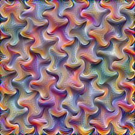
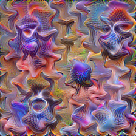
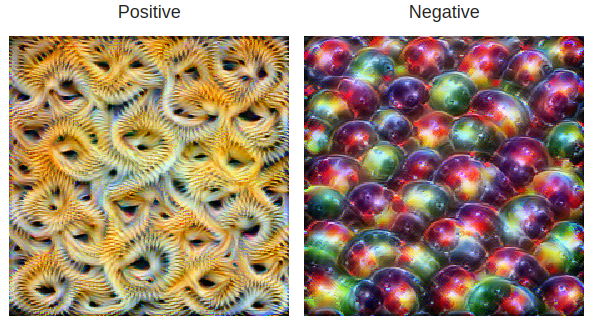
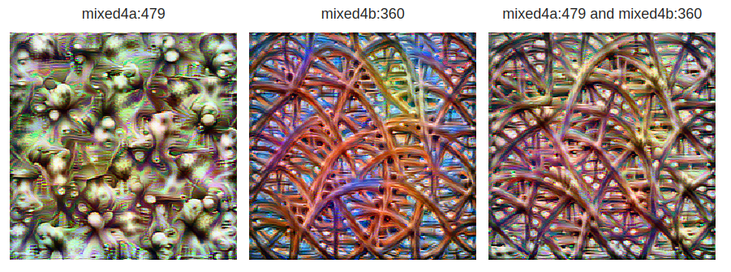

# TorchLight

`torchlight` is a suit of optimization codes for visualizing what a layer, channel or neuron learns. The module is a result of my attempt to learn reverse-engineer feature visualization techniques. A large part of the module is either taken or insipired by the [lucent](https://github.com/greentfrapp/lucent/tree/dev) library (which, in turn, is [lucid](https://github.com/tensorflow/lucid), adapted for PyTorch.)

## Usage

The module is very straightforward to use. Here is an example of how to visualize the 97th channel of the `mixed4a` layer of the InceptionV1 model.

```python
# import the main class that does the optimization
from torchlight.optimize import FeatureViz
# import the model
from torchlight.models import InceptionV1


# load the model
model = InceptionV1(pretrained=True, redirected_ReLU=True).eval()
# create an instance of the FeatureViz class with objective as the 97th channel of the mixed4a layer
fc = FeatureViz(model=model, objective="mixed4a:97")
images = fc.visualize(thresholds=[512, 1024, 2028], show_last_image=True,lr=0.05)
```

This will create a list of images that show the optimization process at different stages. The `thresholds` parameter is used to specify the number of iterations at which the image is saved. The `show_last_image` parameter is used to specify whether to show the last image or not. The `lr` parameter is used to specify the learning rate of the optimization process. `images` is a list of images that show the optimization process at different stages. The image at last index is the final image and should look like:



If you want more control over the optimization objective, you can use the `create_objective` function which internally calls two classes `Hook` and `Objective` to create the objective. Suppose you want to optmize a combination of two objectives, you can do the following:

```python
from torchlight.objective import create_objective

# create the objective to visualize the 97th channel of the mixed4a layer
objective_1 = create_objective("mixed4a:97")
# create the objective to visualize the 143rd channel of the mixed5a layer
objective_2 = create_objective("mixed5a:143")
# A number of operators are overloaded to allow for easy addition of objectives
objective = objective_1 + objective_2
# create an instance of the FeatureViz class with the objective
fc = FeatureViz(model=model, objective=objective)
images = fc.visualize(thresholds=[512, 1024, 2028], show_last_image=True,lr=0.05)
```

Here is the final image:



The module implemets methods to get parameterize image, combine objectives in an arbitrary ways, apply different transformations to the image, etc. A number of interesting visualizations can be created using this module. A couple of examples and the code to generate them are show below.

### Positive and Negative Optimization

```python
# create two objectives with the same layer and channel
objective_1 = create_objective("mixed4b:154", batch=0)
objective_2 = create_objective("mixed4b:154", batch=1)
# maximizes the activation for the first image
# and minimizes the activation for the second image
objective = objective_1 - objective_2
fv = FeatureViz(model=model, objective=objective)

# create a parameterize image with two batches
param_f = lambda: get_image(w=224, batch=2, decorrelate=True)

images = fv.visualize(param_f, show_last_image=True, show_progress=True, thresholds=[512, 1024, 2048], lr=0.05)
```

This will create an image that maximizes the activation for the first image and minimizes the activation for the second image. The optimized images are:



### Interpolate Between two Channels

```python
from torchlight.io import show_images
# Choose two channels to interpolate between
neuron1 = "mixed4a:479"
neuron2 = "mixed4b:360"

# The image should have three batches
param_f = lambda: get_image(w=224, batch=3, decorrelate=True)

# create the objective to interpolate between the two channels
objective = (
    create_objective(neuron1, batch=0) # only neuron1
    + create_objective(neuron2, batch=1) # only neuron2
    + create_objective(neuron1, batch=2) # interpolate between neuron1 and neuron2
    + create_objective(neuron2, batch=2) # interpolate between neuron1 and neuron2
)
fv = FeatureViz(model=model, objective=objective)
images = fv.visualize(
    param_f,
    show_last_image=False,
    show_progress=True,
    thresholds=[512, 1024, 2048],
    lr=0.05,
)
# show the images with the two neurons and the interpolation
show_images(images[-1], [neuron1, neuron2, neuron1+ " and "+ neuron2])
```

Here is the final image:


